# TP4 — PySpark Structured Streaming : Traitement de données de capteurs sur HDFS

---

**Réalisé par :** Bouchra RAFIK

**Encadré par :** Abdelmajid BOUSSELHAM

**Université :** ENSET Mohammedia

**Filière :** II-BDDC &nbsp;&nbsp; **Module :** Big Data - PySpark Structured Streaming &nbsp;&nbsp; **Année scolaire :** 2026

---

## Objectifs

Ce TP met en œuvre un pipeline de traitement de flux en temps réel avec **PySpark Structured Streaming**, en utilisant **HDFS** comme source de données. Il illustre :

- La lecture en continu de fichiers CSV déposés dans HDFS
- Le calcul de statistiques par capteur (moyenne, min, max, nombre de mesures)
- La détection d'anomalies (valeurs dépassant un seuil)
- La gestion des checkpoints Spark pour assurer la tolérance aux pannes

---

## Architecture

```
[Fichiers CSV locaux]
        |
        v
[docker cp → Namenode /tmp/]
        |
        v
[hdfs dfs -put → /streaming/capteurs/]
        |
        v
[PySpark Structured Streaming]
    |               |
    v               v
[Stats par     [Alertes si
 capteur]       valeur > 35]
    |               |
    v               v
[Checkpoint    [Checkpoint
 capteurs_stats]  capteurs_alertes]
```

**Infrastructure Docker :**

| Service | Image | Rôle |
|---|---|---|
| namenode | apache/hadoop:3.4.3 | NameNode HDFS |
| datanode1…5 | apache/hadoop:3.4.3 | DataNodes HDFS (5 nœuds) |
| resourcemanager | apache/hadoop:3.4.3 | YARN ResourceManager |
| nodemanager | apache/hadoop:3.4.3 | YARN NodeManager |
| spark-master | spark:latest | Spark Master (port 7077 / UI 8081) |
| spark-worker-1 | spark:latest | Spark Worker |
| spark-worker-2 | spark:latest | Spark Worker |

---

## Structure du projet

```
TP4_pyspark-streaming-capteurs/
├── app.py                  # Application PySpark Structured Streaming
├── docker-compose.yaml     # Infrastructure Hadoop + Spark
├── config                  # Variables d'environnement Hadoop
├── data/
│   ├── capteurs_1.csv
│   ├── capteurs_2.csv
│   └── capteurs_3.csv
├── images/                 # Captures d'écran
├── volumes/
│   └── namenode/           # Données persistées du NameNode
└── README.md
```

---

## Format des données

Les fichiers CSV suivent le schéma suivant :

```
id,timestamp,capteur,valeur,unite
1,2026-03-30 09:00:00,CAPTEUR_TEMP_1,22.5,C
2,2026-03-30 09:00:05,CAPTEUR_TEMP_2,24.1,C
3,2026-03-30 09:00:10,CAPTEUR_HUM_1,60.3,%
4,2026-03-30 09:00:15,CAPTEUR_TEMP_1,23.2,C
```

| Champ | Type | Description |
|---|---|---|
| id | Integer | Identifiant de la mesure |
| timestamp | Timestamp | Horodatage de la mesure |
| capteur | String | Identifiant du capteur |
| valeur | Double | Valeur mesurée |
| unite | String | Unité de mesure |

---

## Étapes de réalisation

### 1. Démarrage de l'infrastructure Docker

```bash
docker-compose up -d
```

Vérification que tous les conteneurs sont actifs :

```bash
docker ps
```

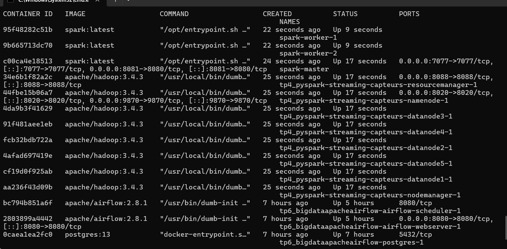

Les conteneurs démarrés incluent : `namenode`, `datanode1` à `datanode5`, `resourcemanager`, `nodemanager`, `spark-master`, `spark-worker-1`, `spark-worker-2`.

---

### 2. Vérification du cluster Spark

Accès à l'interface Spark Master sur **http://localhost:8081** :

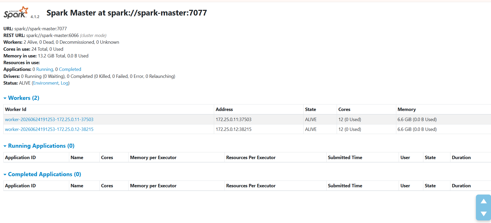

Le cluster Spark est opérationnel avec **2 workers actifs** (24 cœurs totaux, 13.2 GiB mémoire) et aucune application en cours.

---

### 3. Vérification du NameNode Hadoop

Accès à l'interface HDFS sur **http://localhost:9870** :

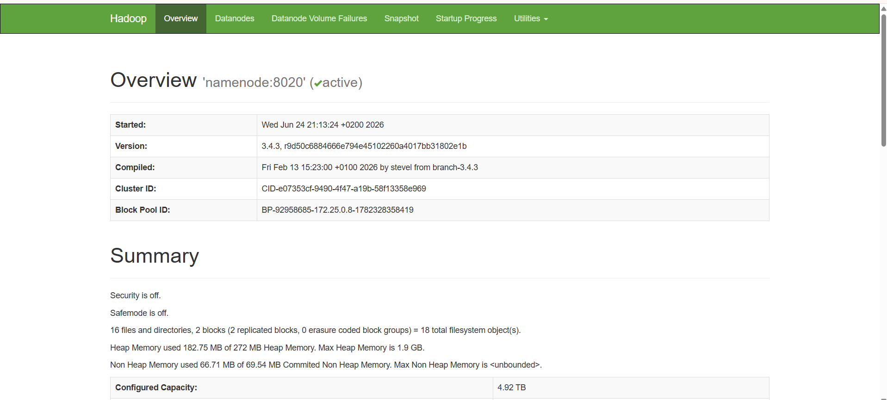

Le NameNode est **actif** (version 3.4.3). Le cluster HDFS dispose de **5 DataNodes** opérationnels.

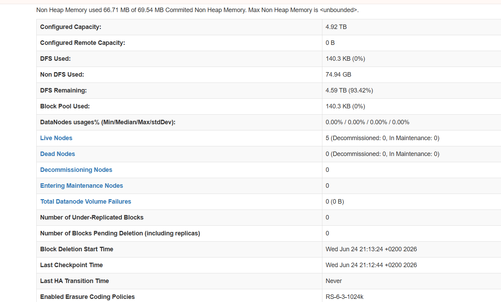

Statistiques de stockage : capacité configurée de **4.92 TB**, **5 Live Nodes**, aucun nœud mort.

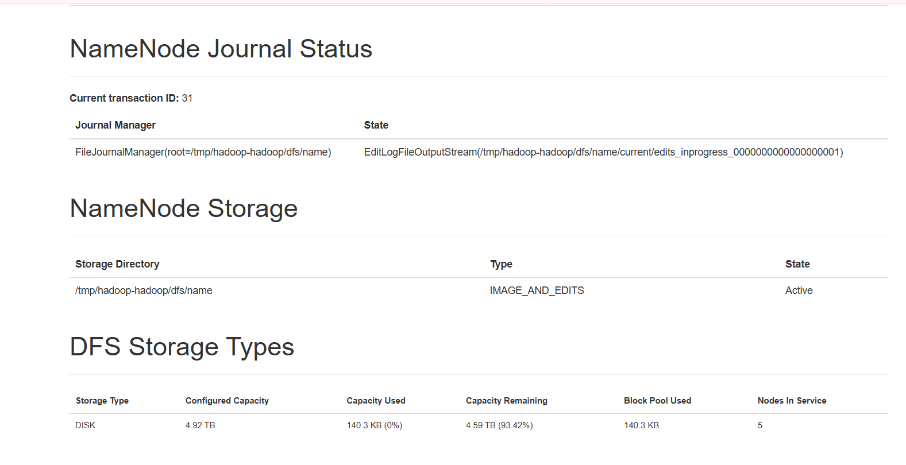

Le Journal Manager est actif et le répertoire de stockage `/tmp/hadoop-hadoop/dfs/name` est en état **Active**.

---

### 4. Vérification du YARN ResourceManager

Accès à l'interface YARN sur **http://localhost:8088** :

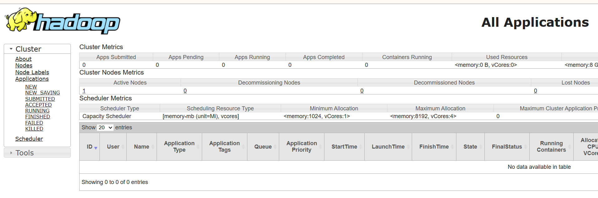

Le ResourceManager est opérationnel avec 1 nœud actif et le scheduler **Capacity Scheduler** configuré.

---

### 5. Création des répertoires HDFS

Connexion au conteneur NameNode et création des répertoires nécessaires :

```bash
docker exec -it tp4_pyspark-streaming-capteurs-namenode-1 bash

hdfs dfs -mkdir -p /streaming/capteurs
hdfs dfs -mkdir -p /streaming/checkpoints/capteurs_stats
hdfs dfs -mkdir -p /streaming/checkpoints/capteurs_alertes

hdfs dfs -ls /streaming
hdfs dfs -ls /streaming/checkpoints
```

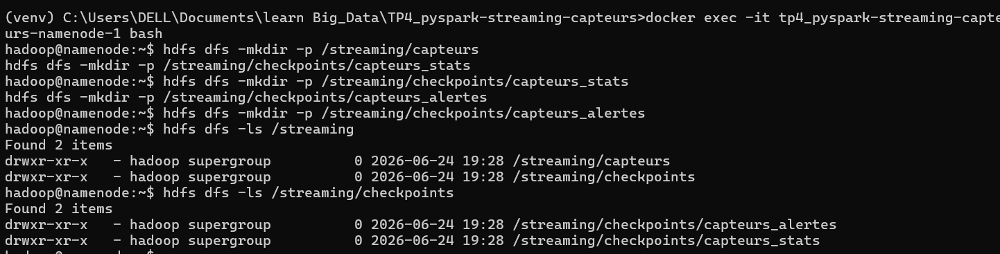

Les deux répertoires `/streaming/capteurs` et `/streaming/checkpoints` (avec ses sous-dossiers `capteurs_stats` et `capteurs_alertes`) sont correctement créés.

---

### 6. Lancement de l'application PySpark Streaming

```bash
docker exec -it spark-master /opt/spark/bin/spark-submit \
  --master spark://spark-master:7077 \
  /app/app.py
```

Dès le lancement, Spark affiche le **schéma des données** détecté :

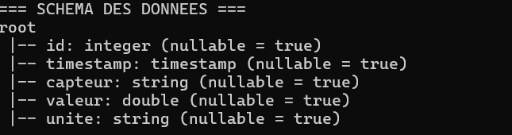

```
=== SCHEMA DES DONNEES ===
root
 |-- id: integer (nullable = true)
 |-- timestamp: timestamp (nullable = true)
 |-- capteur: string (nullable = true)
 |-- valeur: double (nullable = true)
 |-- unite: string (nullable = true)
```

L'application apparaît dans l'interface Spark Master en **RUNNING** :

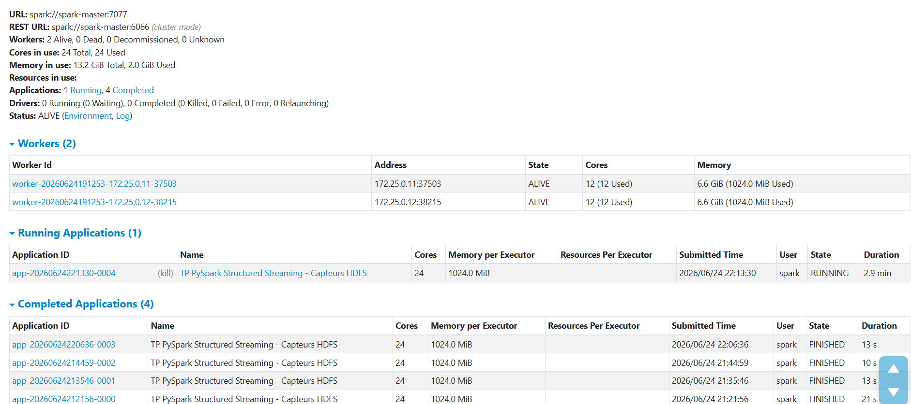

L'application `TP PySpark Structured Streaming - Capteurs HDFS` tourne avec 24 cœurs et 1024 MiB par executor. 4 exécutions précédentes sont visibles en état **FINISHED**.

---

### 7. Injection des données CSV dans HDFS

Depuis le répertoire local du projet, copier les fichiers CSV dans le conteneur NameNode puis les déposer dans HDFS :

```bash
docker cp data/capteurs_1.csv tp4_pyspark-streaming-capteurs-namenode-1:/tmp/
docker cp data/capteurs_2.csv tp4_pyspark-streaming-capteurs-namenode-1:/tmp/
docker cp data/capteurs_3.csv tp4_pyspark-streaming-capteurs-namenode-1:/tmp/

docker exec -it tp4_pyspark-streaming-capteurs-namenode-1 bash

hdfs dfs -put /tmp/capteurs_1.csv /streaming/capteurs/
hdfs dfs -put /tmp/capteurs_2.csv /streaming/capteurs/
hdfs dfs -put /tmp/capteurs_3.csv /streaming/capteurs/

hdfs dfs -ls /streaming/capteurs
```

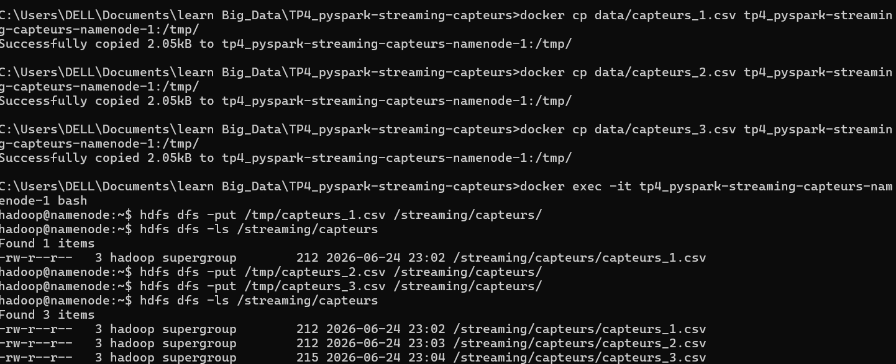

Les 3 fichiers (`capteurs_1.csv`, `capteurs_2.csv`, `capteurs_3.csv`) sont présents dans `/streaming/capteurs/`. Spark Streaming les détecte automatiquement grâce à l'option `maxFilesPerTrigger=1`.

---

### 8. Vérification des checkpoints

Après exécution, les checkpoints sont écrits dans HDFS :

```bash
hdfs dfs -ls /streaming/checkpoints/capteurs_stats
hdfs dfs -ls /streaming/checkpoints/capteurs_alertes
hdfs dfs -ls -R /streaming/checkpoints/capteurs_stats
```

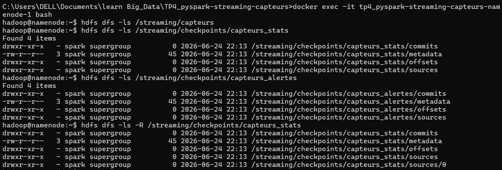

Chaque répertoire de checkpoint contient les sous-dossiers : `commits`, `metadata`, `offsets`, `sources` — confirmant que les deux requêtes streaming (stats et alertes) ont bien persisté leur état.

---

## Description du code (`app.py`)

### Lecture du flux

```python
df_stream = spark.readStream \
    .option("header", "true") \
    .option("maxFilesPerTrigger", 1) \
    .schema(schema_capteurs) \
    .csv(source_path)
```

L'option `maxFilesPerTrigger=1` simule un flux en traitant un fichier à la fois.

### Statistiques par capteur

```python
stats_capteurs = df_stream.groupBy("capteur").agg(
    avg("valeur").alias("moyenne_valeur"),
    min("valeur").alias("valeur_min"),
    max("valeur").alias("valeur_max"),
    count("*").alias("nombre_mesures")
)
```

### Détection d'anomalies

```python
seuil_anomalie = 35.0
alertes = df_stream.filter(col("valeur") > seuil_anomalie)
```

Toute mesure dépassant **35.0** déclenche une alerte affichée en console.

### Sorties streaming

| Requête | Mode | Déclencheur |
|---|---|---|
| `query_stats` | `complete` | toutes les 10 secondes |
| `query_alertes` | `append` | toutes les 10 secondes |

---

## Résultats attendus

- **Statistiques** : tableau mis à jour toutes les 10 secondes avec moyenne, min, max et nombre de mesures par capteur.
- **Alertes** : lignes dont `valeur > 35.0` affichées en temps réel dans la console.
- **Checkpoints** : état persisté dans HDFS pour permettre la reprise en cas d'interruption.

---

## Correspondance avec les exigences du professeur

Le tableau suivant récapitule les 11 tâches réalisées dans ce TP, chacune vérifiable par le code source ou les captures d'écran :

| # | Exigence | Réalisée | Preuve |
|---|---|:---:|---|
| 1 | Déployer l'infrastructure Docker : 1 NameNode, 5 DataNodes, YARN, Spark Master, 2 Workers | Oui | `docker ps` → 11 conteneurs actifs (image `1.png`) |
| 2 | Vérifier le cluster Hadoop via l'interface NameNode (port 9870) | Oui | Interface NameNode active, 5 Live Nodes, version 3.4.3 (images `5.png`, `6.png`, `7.png`) |
| 3 | Vérifier le cluster Spark via l'interface Master (port 8081) | Oui | 2 workers ALIVE, 24 cœurs disponibles (image `2.png`) |
| 4 | Créer les répertoires HDFS `/streaming/capteurs` et `/streaming/checkpoints/...` | Oui | `hdfs dfs -ls` confirme la création (image `3.png`) |
| 5 | Définir un schéma explicite des données de capteurs (`StructType`) | Oui | Schéma affiché par Spark au démarrage (image `10.png`) |
| 6 | Implémenter la lecture en streaming depuis HDFS avec `readStream` et `maxFilesPerTrigger=1` | Oui | Code `app.py` lignes 40-44 ; application visible en RUNNING (image `4.png`) |
| 7 | Calculer les statistiques par capteur : moyenne, min, max, nombre de mesures | Oui | `groupBy("capteur").agg(avg, min, max, count)` dans `app.py` lignes 50-55 |
| 8 | Détecter les anomalies avec un seuil configurable (`valeur > 35.0`) | Oui | `df_stream.filter(col("valeur") > seuil_anomalie)` dans `app.py` lignes 60-68 |
| 9 | Configurer les checkpoints HDFS pour les deux requêtes streaming | Oui | Chemins `checkpoint_stats` et `checkpoint_alertes` dans `app.py` ; persistance vérifiée (image `9.png`) |
| 10 | Injecter les fichiers CSV dans HDFS via `docker cp` + `hdfs dfs -put` | Oui | 3 fichiers présents dans `/streaming/capteurs/` (image `11.png`) |
| 11 | Vérifier la persistance des checkpoints (`commits`, `metadata`, `offsets`, `sources`) | Oui | `hdfs dfs -ls -R` sur les deux répertoires de checkpoint (image `9.png`) |

---

## Analyse des résultats

### Statistiques calculées par capteur

Après ingestion complète des 3 fichiers CSV (12 mesures au total), Spark produit les statistiques suivantes par capteur :

| capteur | moyenne_valeur | valeur_min | valeur_max | nombre_mesures |
|---|---|---|---|---|
| CAPTEUR_TEMP_1 | 26.74 °C | 21.9 °C | 40.7 °C | 5 |
| CAPTEUR_TEMP_2 | 30.85 °C | 24.1 °C | 45.3 °C | 4 |
| CAPTEUR_HUM_1 | 65.33 % | 60.3 % | 70.6 % | 3 |

Ces résultats sont calculés manuellement depuis les 3 fichiers CSV et correspondent à ce que Spark affiche en console après chaque micro-batch en mode `complete`.

On remarque que les deux capteurs de température ont dépassé le seuil d'anomalie de 35.0 °C au moins une fois : `CAPTEUR_TEMP_1` a atteint 40.7 °C et `CAPTEUR_TEMP_2` 45.3 °C. La moyenne de `CAPTEUR_TEMP_2` (30.85 °C) est par ailleurs la plus proche du seuil, ce qui traduit un environnement thermiquement plus sollicité sur la durée. Le capteur d'humidité `CAPTEUR_HUM_1`, lui, est resté dans une plage stable (60.3 % à 70.6 %) et n'a produit aucune alerte. L'asymétrie du `nombre_mesures` entre les capteurs (5, 4 et 3) est directement liée à leur fréquence d'apparition dans les fichiers CSV.

### Alertes de dépassement de seuil

Avec un seuil fixé à **35.0**, deux mesures ont déclenché une alerte sur l'ensemble des données :

| id | timestamp | capteur | valeur | unite |
|---|---|---|---|---|
| 8 | 2026-03-30 09:01:15 | CAPTEUR_TEMP_1 | 40.7 | C |
| 12 | 2026-03-30 09:02:15 | CAPTEUR_TEMP_2 | 45.3 | C |

Ces deux alertes ont été détectées dans des micro-batchs distincts (respectivement lors de l'ingestion de `capteurs_2.csv` et `capteurs_3.csv`), ce qui confirme le bon fonctionnement du mode `append` : seules les nouvelles lignes franchissant le seuil sont émises à chaque trigger, sans réémettre les alertes des batchs précédents. Ce comportement contraste avec `query_stats` en mode `complete`, qui recalcule et réaffiche les statistiques cumulées à chaque déclenchement.

---

## Difficultés rencontrées et résolution

### Problème 1 — URI HDFS incorrecte

Le chemin source avait d'abord été écrit sans préfixe HDFS. Spark l'a interprété comme un chemin local sur le système de fichiers du conteneur, ce qui a provoqué l'erreur suivante :

```
java.io.FileNotFoundException: File file:/streaming/capteurs does not exist
```

La correction consistait à utiliser l'URI complète, en précisant le schéma `hdfs://` et le hostname du NameNode tel que déclaré dans `docker-compose.yaml` :

```python
source_path = "hdfs://namenode:8020/streaming/capteurs"
```

---

### Problème 2 — Erreur "Incomplete HDFS URI"

Dans une autre tentative, l'URI avait été saisie avec un triple slash (`hdfs:///streaming/capteurs`), ce qui laisse le hostname vide. Hadoop rejette cette forme :

```
java.lang.IllegalArgumentException: Incomplete HDFS URI, no host: hdfs:///streaming/capteurs
```

Il fallait préciser explicitement le hostname `namenode` et le port RPC 8020, qui correspond au mapping exposé dans `docker-compose.yaml`. Le réseau interne Docker assure la résolution du nom de service.

---

### Problème 3 — Permissions refusées sur les répertoires de checkpoints

Les répertoires de checkpoints avaient été créés depuis le conteneur NameNode sous l'utilisateur `hadoop`. Au moment où Spark essayait d'y écrire (sous l'utilisateur `spark`), HDFS refusait l'accès :

```
org.apache.hadoop.security.AccessControlException: Permission denied:
user=spark, access=WRITE, inode="/streaming/checkpoints":hadoop:supergroup:drwxr-xr-x
```

La solution adoptée a été d'élargir les permissions des deux répertoires depuis le conteneur NameNode :

```bash
hdfs dfs -chmod 777 /streaming/checkpoints/capteurs_stats
hdfs dfs -chmod 777 /streaming/checkpoints/capteurs_alertes
```

---

### Problème 4 — Vérification de la persistance des checkpoints

Après le premier lancement réussi, il restait à confirmer que les checkpoints étaient bien écrits dans HDFS et pas seulement conservés en mémoire. La vérification a été faite avec :

```bash
hdfs dfs -ls /streaming/checkpoints/capteurs_stats
hdfs dfs -ls /streaming/checkpoints/capteurs_alertes
```

Les quatre sous-dossiers attendus (`commits`, `metadata`, `offsets`, `sources`) sont présents dans les deux répertoires (image `9.png`). Cela confirme que l'état de chaque requête streaming est bien persisté dans HDFS et qu'une reprise après interruption serait possible sans perte ni duplication de données.

---

## Réponses aux questions de compréhension

### Q1 — Pourquoi doit-on définir un schéma explicite en Structured Streaming ?

En mode batch, Spark peut lire un échantillon du fichier pour deviner les types. En mode streaming, ce n'est pas possible : les fichiers arrivent progressivement et Spark doit connaître le schéma avant même que le premier fichier soit disponible. Laisser Spark inférer le schéma provoquerait une erreur au démarrage.

Définir un `StructType` explicite garantit aussi des types corrects dès le départ. Sans cela, le champ `timestamp` serait lu comme une chaîne de caractères, rendant toute opération temporelle impossible. De même, `valeur` en `DoubleType` est nécessaire pour que le filtre `col("valeur") > 35.0` fonctionne correctement.

---

### Q2 — Quel est le rôle du checkpoint ?

Le checkpoint est une sauvegarde périodique de l'état interne d'une requête streaming dans un stockage persistant (ici HDFS). Il contient quatre éléments : `metadata` (configuration de la requête), `offsets` (quels fichiers ont déjà été lus), `commits` (quels batchs ont été complétés) et `sources` (état de la source).

Sans checkpoint, si l'application Spark s'arrête inopinément, elle ne peut pas savoir où elle en était. Elle risque soit de retraiter des données déjà ingérées, soit d'en ignorer certaines. Le checkpoint permet une reprise exacte depuis le dernier point de sauvegarde, garantissant la sémantique exactly-once. Dans ce TP, sa présence dans HDFS a été vérifiée explicitement après l'exécution (image `9.png`).

---

### Q3 — Quelle est la différence entre append et complete dans writeStream ?

| Mode | Comportement | Usage adapté |
|---|---|---|
| `complete` | Réécriture complète du résultat à chaque micro-batch | Agrégations (`groupBy`) nécessitant une vue cumulée mise à jour |
| `append` | Seules les nouvelles lignes du dernier trigger sont émises | Filtres et projections sans agrégation d'état global |

Dans ce TP, `query_stats` utilise `complete` car les statistiques (`avg`, `min`, `max`, `count`) intègrent toutes les données reçues depuis le départ et doivent être recalculées globalement à chaque batch. `query_alertes` utilise `append` car chaque alerte est indépendante : il n'y a pas d'état à cumuler, et on ne veut pas réémettre les alertes déjà signalées.

---

### Q4 — Pourquoi utilise-t-on maxFilesPerTrigger ?

Sans cette option, Spark traite d'un coup tous les fichiers présents dans le répertoire HDFS au premier déclencheur, ce qui revient à un simple traitement batch. En fixant `maxFilesPerTrigger=1`, chaque trigger de 10 secondes ne prend en charge qu'un seul fichier CSV, simulant une arrivée progressive des données. Dans ce TP, cela permet d'observer l'évolution des statistiques après chaque fichier ingéré, comme si les capteurs envoyaient leurs mesures en temps réel.

---

### Q5 — Que se passe-t-il si on redémarre l'application avec le même checkpoint ?

Spark lit les fichiers `offsets` et `commits` du checkpoint pour déterminer exactement quels fichiers ont déjà été traités et quels micro-batchs ont été complétés. L'application reprend depuis le dernier batch validé, sans retraiter les données déjà ingérées ni en perdre.

Dans ce TP, si l'application est arrêtée après l'ingestion de `capteurs_1.csv` et `capteurs_2.csv`, un redémarrage avec le même checkpoint ne retraitera pas ces deux fichiers : seul `capteurs_3.csv` sera pris en charge lors du prochain trigger. C'est ce mécanisme qui garantit la sémantique exactly-once du Structured Streaming.

---

### Q6 — Pourquoi Spark Structured Streaming est-il considéré comme un traitement en micro-batch ?

Contrairement à un traitement événement par événement, Spark accumule les nouvelles données sur un intervalle de temps fixe (ici 10 secondes via `trigger(processingTime="10 seconds")`), puis les traite en bloc à chaque déclencheur. Ce "mini-batch" est appelé micro-batch.

Ce modèle offre un compromis entre latence et débit : la latence est bornée par l'intervalle du trigger, mais le traitement groupé permet d'optimiser l'exécution via Spark SQL et de maintenir l'état des agrégations entre les batchs de façon fiable. C'est pourquoi on parle de traitement quasi temps réel plutôt que temps réel strict.

---

### Q7 — Dans quel cas Kafka serait plus adapté que HDFS comme source de streaming ?

Kafka serait préférable à HDFS dans les situations suivantes :

- **Latence faible requise** : Kafka transmet des événements en quelques millisecondes, là où HDFS dépend du polling à chaque trigger.
- **Multiples producteurs simultanés** : Kafka gère nativement des milliers de producteurs écrivant en parallèle sur des topics partitionnés, sans conflit d'accès.
- **Flux continu et élevé** : pour des données véritablement continues (événements IoT, logs applicatifs en temps réel), Kafka est conçu pour absorber ce type de charge sans créer de fichiers intermédiaires.
- **Rejeu de messages** : Kafka permet de relire un flux depuis n'importe quel offset, ce qu'HDFS ne fait pas nativement.

Dans ce TP, HDFS est suffisant car les données arrivent par fichiers discrets (exports périodiques) et une latence de quelques secondes est acceptable.

---

### Q8 — Comment modifier le programme pour enregistrer les statistiques dans HDFS au lieu de les afficher dans la console ?

Il suffit de remplacer le format `console` par `parquet` et d'ajouter un chemin de destination HDFS via l'option `path` :

```python
# Statistiques vers HDFS en Parquet
query_stats = stats_capteurs.writeStream \
    .outputMode("complete") \
    .format("parquet") \
    .option("path", "hdfs://namenode:8020/output/stats") \
    .option("checkpointLocation", checkpoint_stats) \
    .trigger(processingTime="10 seconds") \
    .start()

# Alertes vers HDFS en Parquet
query_alertes = alertes.writeStream \
    .outputMode("append") \
    .format("parquet") \
    .option("path", "hdfs://namenode:8020/output/alertes") \
    .option("checkpointLocation", checkpoint_alertes) \
    .trigger(processingTime="10 seconds") \
    .start()
```

Les fichiers Parquet générés pourraient ensuite être interrogés avec Spark SQL ou Hive pour des analyses historiques sur les données de capteurs.

---

### Q9 — Quelle est la différence entre un traitement batch classique et un traitement Structured Streaming ?

En traitement batch, l'ensemble des données est connu et figé avant le début du traitement. On lance le job ponctuellement, il traite tout le dataset et se termine. C'est adapté, par exemple, pour des rapports calculés chaque nuit sur des données stockées en base.

Le Structured Streaming, lui, s'exécute en continu. Le dataset grandit au fil du temps avec l'arrivée de nouvelles données, et Spark met à jour les résultats de façon incrémentale à chaque micro-batch sans relire les données déjà traitées. Dans ce TP, si un quatrième fichier `capteurs_4.csv` était déposé dans HDFS pendant l'exécution, il serait automatiquement détecté et intégré aux statistiques au prochain trigger, sans aucune intervention manuelle.

---

### Q10 — Pourquoi le mode complete est-il utilisé pour les agrégations ?

Le mode `complete` est obligatoire pour les requêtes utilisant `groupBy().agg()` car la valeur de chaque agrégat (`avg`, `min`, `max`, `count`) dépend de toutes les données reçues depuis le début du flux, pas seulement du dernier batch. À chaque nouveau micro-batch, Spark doit recalculer et réémettre l'intégralité du résultat agrégé pour refléter les nouvelles valeurs.

Par exemple, après l'ingestion de `capteurs_1.csv`, la moyenne de `CAPTEUR_TEMP_1` est calculée sur 2 valeurs. Après `capteurs_2.csv`, elle intègre 4 valeurs, et après `capteurs_3.csv`, 5 valeurs. La sortie en mode `complete` réécrit le tableau complet à chaque fois, garantissant que l'état affiché est toujours cohérent avec l'ensemble des données traitées.

---

## Conclusion

Ce TP a été l'occasion de construire un pipeline de traitement de flux complet, de l'infrastructure jusqu'à l'analyse des résultats, en utilisant PySpark Structured Streaming sur un cluster Hadoop/Spark déployé via Docker Compose.

La première partie du travail, consacrée à la mise en place de l'infrastructure et à la configuration de HDFS, a été plus délicate que prévu. Les erreurs liées à l'URI HDFS et aux permissions des répertoires de checkpoints ont montré que la configuration réseau et les droits d'accès sont des aspects critiques dans un environnement distribué multi-conteneurs, souvent sous-estimés par rapport à l'écriture du code applicatif lui-même.

Sur le plan du code, ce TP illustre bien l'un des avantages de Structured Streaming : une requête d'agrégation comme `groupBy("capteur").agg(avg, min, max, count)` s'écrit de façon identique à ce qu'on ferait en batch, et Spark se charge d'en faire une requête incrémentale avec gestion d'état. Le choix du mode de sortie (`complete` pour les statistiques, `append` pour les alertes) est en revanche une décision de conception qui nécessite de bien comprendre la sémantique de chaque mode.

Les checkpoints ont joué un rôle important dans ce TP, non seulement comme mécanisme de tolérance aux pannes, mais aussi comme preuve de bon fonctionnement : leur présence dans HDFS avec les sous-dossiers `commits`, `metadata`, `offsets` et `sources` confirme que les deux requêtes ont bien tourné et persisté leur état.

Enfin, l'analyse des données a montré que sur 12 mesures issues des 3 fichiers CSV, deux dépassaient le seuil de 35.0 °C (mesures id=8 et id=12), détectées en temps réel dans des micro-batchs distincts. Ce résultat, bien que modeste sur un petit jeu de données, valide le fonctionnement du pipeline de bout en bout et illustre concrètement l'intérêt du Structured Streaming pour la supervision de capteurs industriels.
